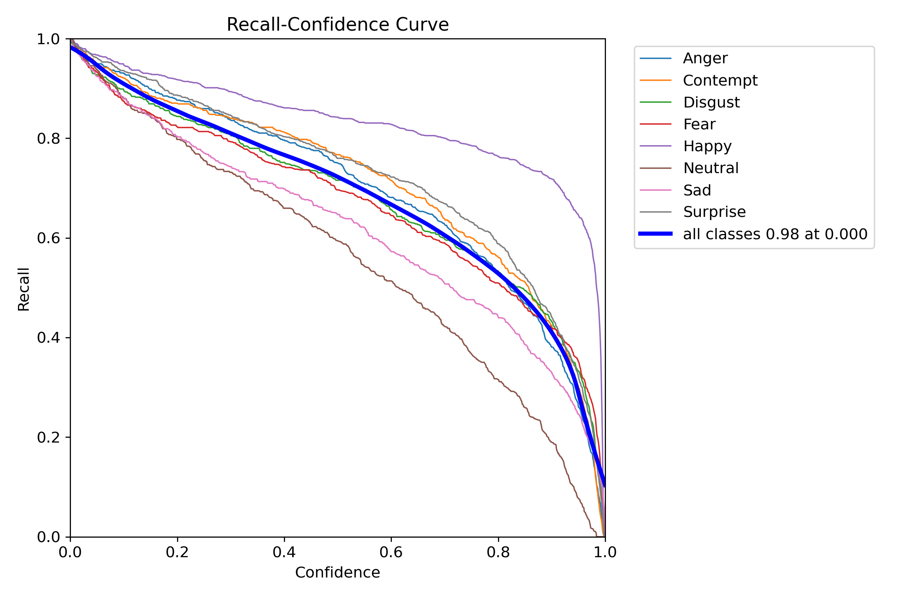
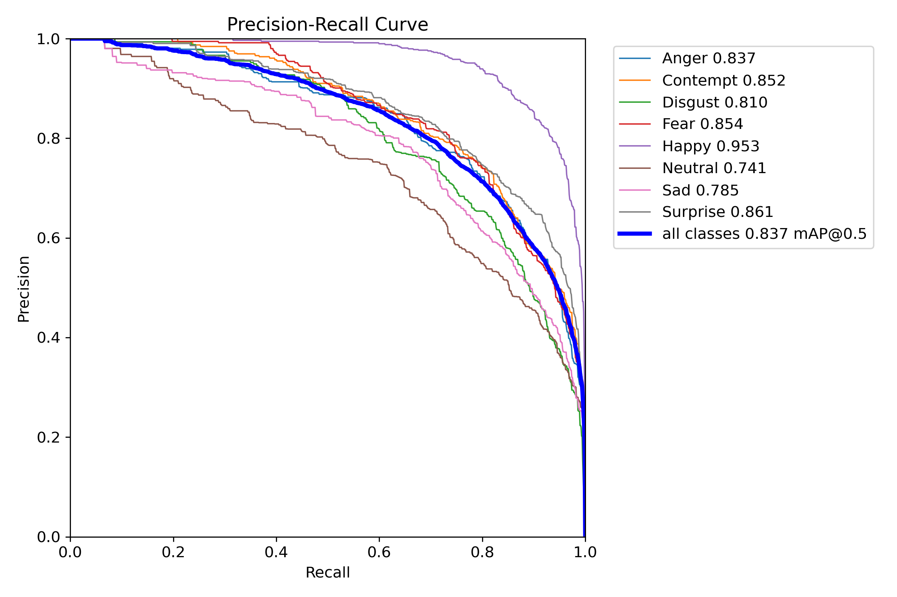
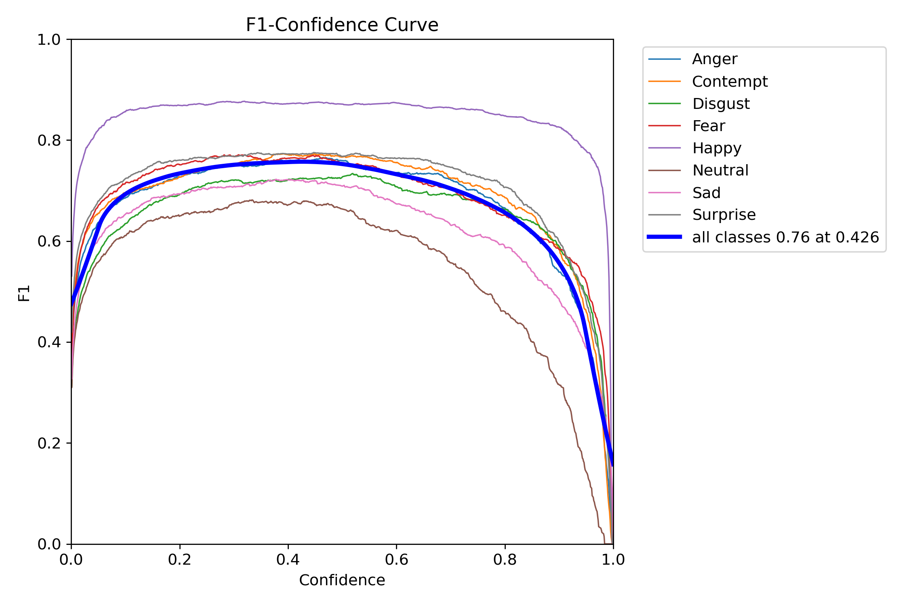
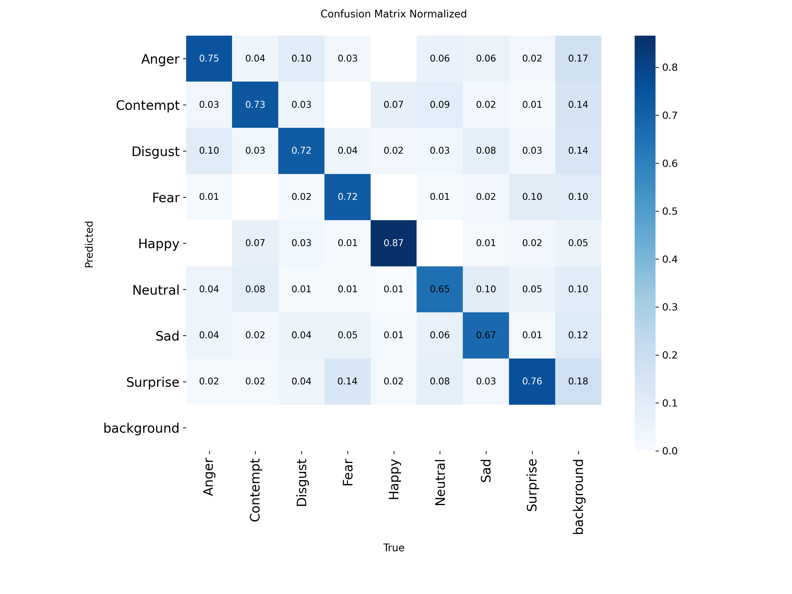

# Projekt YOLO

## Wprowadzenie

Celem projektu było stworzenie systemu do rozpoznawania emocji na podstawie wyrazu twarzy, wykorzystującego zaawansowane modele głębokiego uczenia.

## Jak to działa?

- W przeciwieństwie do innych algorytmów, YOLO analizuje cały obraz tylko raz

1. **Podział na siatkę**: Obraz jest dzielony na siatkę (np. 13x13, 19x19 komórek)
2. **Predykcja w komórkach**: Każda komórka tej siatki jest odpowiedzialna za:

   - Przewidywanie obecności obiektu, którego środek w niej leży.
   - Określanie tzw. "bounding box" (ramki) wokół wykrytego obiektu (współrzędne x, y, szerokość, wysokość).
   - Przewidywanie klasy obiektu wraz z prawdopodobieństwem.

3. **Jedna sieć neuronowa**: Wszystkie te przewidywania (ramki, klasy, prawdopodobieństwa) są generowane jednocześnie przez jedną, głęboką sieć neuronową w pojedynczym przebiegu.
4. **Szybkość i dokładność**: Ta jednoczesna analiza sprawia, że YOLO jest bardzo szybki, zachowując przy tym dobrą dokładność, co zrewolucjonizowało detekcję obiektów.

## Model i Architektura

Wykorzystany model opiera się na architekturze YOLOv11 (You Only Look Once), która jest optymalizowana
do zadań detekcji obiektów w czasie rzeczywistym. Główne cechy modelu:

- **Architektura**: YOLOv11 z dostosowaną warstwą wyjściową dla 8 klas emocji
- **Klasy emocji**: Anger (gniew), Contempt (pogarda), Disgust (wstręt), Fear (strach),
  Happy (szczęście), Neutral (neutralna), Sad (smutek), Surprise (zaskoczenie)
- **Wielkość wejściowa**: 640x640 pikseli
- **Optymalizator**: Adam
- **Learning rate**: 0.01

## Proces Treningowy

Model był trenowany przez 120 epok na zbiorze [Affectnet YOLO Format](https://www.kaggle.com/datasets/fatihkgg/affectnet-yolo-format/data)

### Krzywe uczenia

- **Recall-Confidence**: Wysoki recall (0.98) przy niskim progu pewności (0.000). Oznacza to, że model wykrywa 98% emocji gdy akceptuje nawet najmniejszą pewność.

- **Precision-Recall**: mAP@0.5 wynoszący 0.837 dla wszystkich klas.
  Jest to procent poprawnmych detekcji spośród wszystkich wykrytych. Średnia precyzja wynosi 83.7%
  Najwyższa precyzja: Happy (95.3%); Najniższa: Neutral (74.1%)

- **F1-Confidence**: Maksymalny F1-score 0.76 przy progu pewności 0.426
  Wskazuje na najlepszą ogólną wydajność aplikacji (tj. Optymalny próg akceptowania przetworzonych wyników detekcji powinien być ustawiony na 0.426)

### Macierz pomyłek

Analiza macierzy pomyłek ujawniła:

- Najwyższą precyzję dla klasy "Happy" (0.87)
- Największe trudności w rozróżnieniu "Fear" i "Surprise"
- Częste mylenie "Neutral" z "Sad"

## Ewaluacja modelu

Wyniki ewaluacji na zbiorze testowym:

| Emocja      | Precision | Recall    | F1-score  |
| ----------- | --------- | --------- | --------- |
| Anger       | 0.837     | 0.750     | 0.791     |
| Contempt    | 0.852     | 0.730     | 0.786     |
| Disgust     | 0.810     | 0.720     | 0.762     |
| Fear        | 0.854     | 0.720     | 0.781     |
| Happy       | 0.953     | 0.870     | 0.910     |
| Neutral     | 0.741     | 0.650     | 0.692     |
| Sad         | 0.785     | 0.670     | 0.723     |
| Surprise    | 0.861     | 0.760     | 0.807     |
| **Średnia** | **0.837** | **0.736** | **0.782** |

## Aplikacja Webowa

1. **Analiza na żywo z kamerą**

   - Przetwarzanie klatka po klatce z kamery użytkownika
   - Wyświetlanie wyników w czasie rzeczywistym
   - Pomiar FPS dla monitorowania wydajności

2. **Analiza przesłanych plików**
   - Obsługa obrazów (JPG, PNG) i wideo (MP4)
   - Generowanie wyników z adnotacjami emocji
   - Możliwość pobrania wyników

## Wnioski

1. Model YOLOv11 wykazał się skutecznością w zadaniu rozpoznawania emocji, osiągając średni F1-score 0.782.
2. Najlepiej rozpoznawaną emocją jest "Happy" (F1=0.91), najtrudniejszą "Neutral" (F1=0.69).
3. Dalsze prace powinny skupić się na:
   - Zwiększeniu dokładności dla klasy "Neutral"
   - Zwiększeniu zbioru dla "Contempt"
   - wykorzystanie większego modelu niż YOLOv11n
4. Neutral jest najtrudniejszą do wychwycenia emocją, ponieważ jest to "brak emocji"

Wykorzystane materiały
[Youtube playlist](https://www.youtube.com/playlist?list=PL1FZnkj4ad1P9gulU2Ud6y-1m1fKXTPGW)
[Ultralytics Docs](https://docs.ultralytics.com/models/yolo11/)
[Dataset](https://www.kaggle.com/datasets/fatihkgg/affectnet-yolo-format)
https://medium.com/@nikhil-rao-20/yolov11-explained-next-level-object-detection-with-enhanced-speed-and-accuracy-2dbe2d376f71
